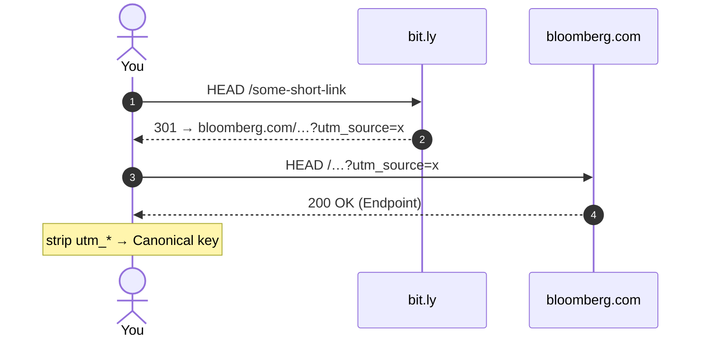

# Clean Links

Decide whether two links point at the same resource, to help with
de-duplicating and counting links.

---

Say _@Alicia_ posts a link to `https://bit.ly/some-short-link` and _@Barry_
posts one to `https://trib.al/another-one`. Did they link to the same thing?

In a browser you'd click both and see what happens, but in code it can
be tricky. Shorteners hide the destination, and changed in tracking
parameters mean the final URLs often mismatch as plain strings.

`clean-links` follows redirects to each link's final destination,
strips the stuff that doesn't change _which_ page a link points at,
and compares what's left.

## Install

```shell
pip install clean_links
```

## Are two links the same?

```pycon
>>> from clean_links import are_equivalent_sync
>>> are_equivalent_sync(
...     "https://bit.ly/some-short-link",
...     "https://trib.al/another-one",
... )
True
```

!!! note

    These calls make live network requests to follow the redirects. The
    library is **async-first** — drop the `_sync` suffix for the coroutine API
    (`await are_equivalent(...)`).

## Group and count links

The real job is usually bulk: given many links, group the ones that
point at the same resource and count them.

```pycon
>>> from clean_links import group_sync
>>> links = [
...     "https://bit.ly/some-short-link",
...     "https://trib.al/another-one",
...     "https://example.com/unrelated",
... ]
>>> groups = group_sync(links)
>>> {key: len(members) for key, members in groups.items()}
{'https://www.bloomberg.com/news/articles/...': 2, 'https://example.com/unrelated': 1}
```

Two of the three links resolve to the same article, so they share one
group of size two.

## Persist across runs

For more links, resolve each link at most once and reuse that work
across runs by giving the `Engine` a SQLite-backed store:

```pycon
>>> import asyncio
>>> from clean_links import Engine, SqliteStore
>>> engine = Engine(store=SqliteStore("cache.db"))
>>> asyncio.run(engine.canonical_key("https://bit.ly/some-short-link"))
'https://www.bloomberg.com/news/articles/...'
```

Re-running the same link, even in a different process, is served from
the cache without another network request. The `Engine` also throttles
requests per host and is polite by default.

## Tune the policy for your data

`clean-links` strips only _known_ tracking parameters and keeps
everything else, so it avoids wrongly merging two different resources
into one. To find the cases where a query parameter is the only thing
making different groups, use `group` with "sensitivity":

```pycon
>>> result = group_sync(
...     ["https://shop.example/item?variant=red",
...      "https://shop.example/item?variant=blue"],
...     show_query_sensitivity=True,
... )
>>> len(result["groups"])          # kept apart (variant might be meaningful)
2
>>> result["query_sensitive"]      # ...but flagged: they'd merge if query dropped
[['https://shop.example/item?variant=red', 'https://shop.example/item?variant=blue']]
```

Review those clusters and decide, per parameter, whether it's junk
(add a rule to strip it) or meaningful (leave it).

## How clean-links decides two URLs are the same

Under the hood, a link is walked to its final **Endpoint**, and equivalence is
decided from the Endpoint's **Canonical key** — the Endpoint is the source of
truth; the redirect graph is only a cache.
Links wrapped in a **Gateway** (e.g. `google.com/url?q=…`,
`l.facebook.com/l.php?u=…`) are _unwrapped_ straight from the URL, so they
resolve to their real target without a request.


